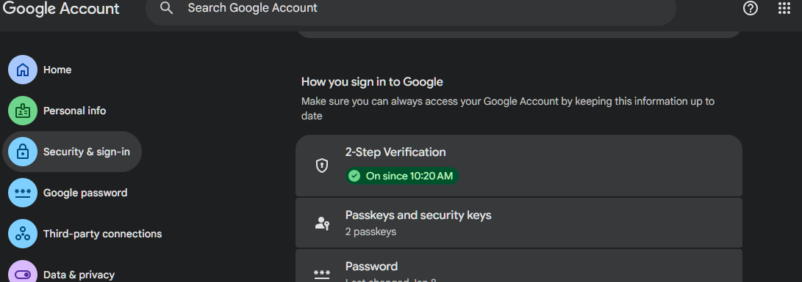
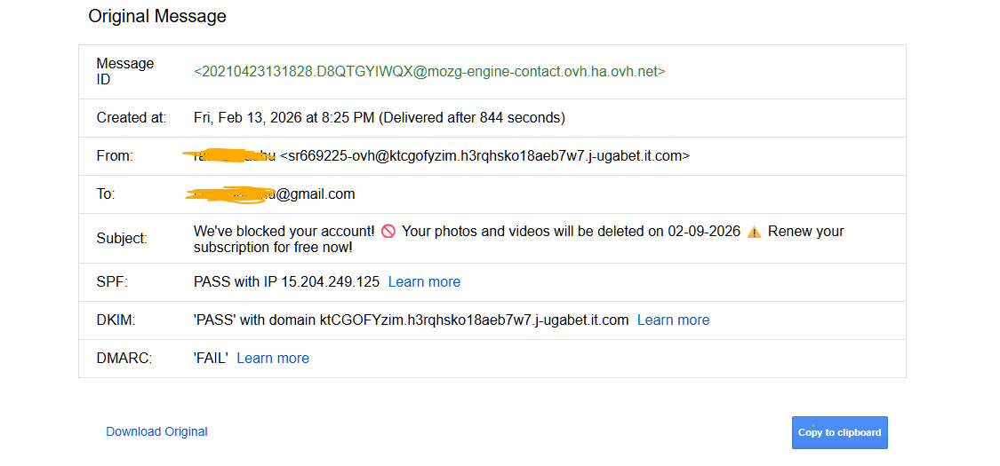
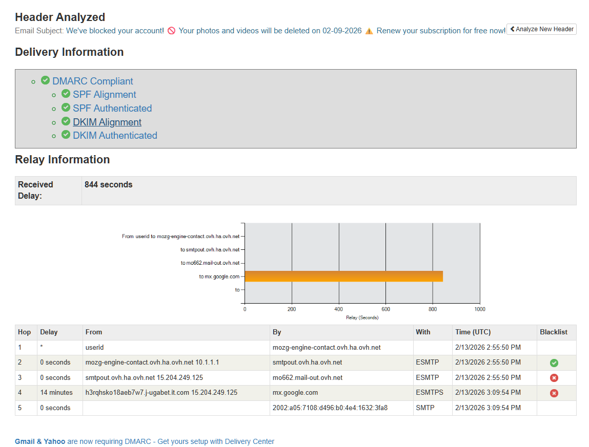
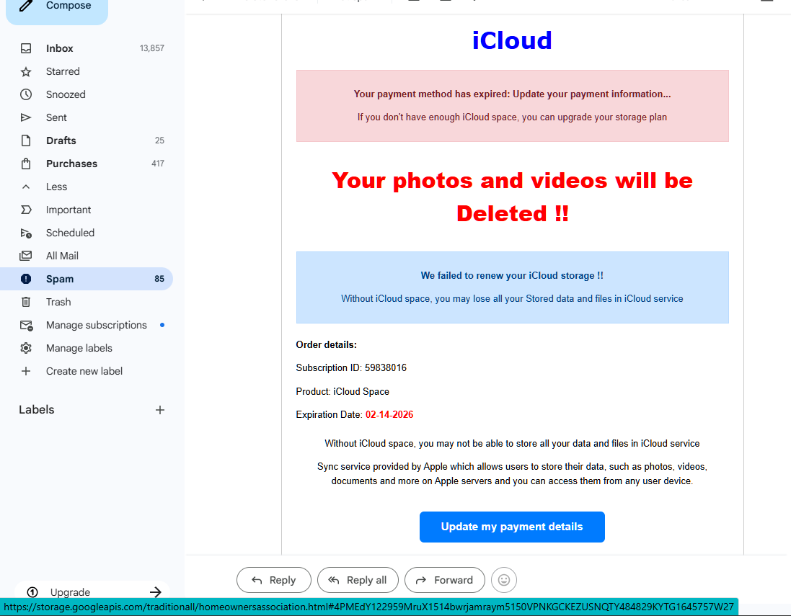

# Analyzing-a-Phishing-Email-Sampl# 📧 Phishing Email Analysis Project

## Project Overview
This project demonstrates hands‑on analysis of a phishing email I received a few days ago.  
The goal is to identify spoofing, header discrepancies, suspicious links, urgent language, and other phishing traits.  
Screenshots of the email body, header metadata, and relay analysis are included as supporting evidence.

---

## 1. Phishing Email
Screenshots included:
### 1. Two-Step Verification

### 2. Email Spoofing Example

### 3. Header Analysis

### 4. Received Phishing Email

---

## 2. Sender Address Spoofing
- **Displayed sender:** Appears as my own email address.  
- **Actual sender (header):** `sr669225-ovh@ktcgofyzim.h3rqhsko18aeb7w7.j-ugabet.it.com`  
- **Observation:** Domain is unrelated to Apple/iCloud → clear spoofing attempt.

---

## 3. Header Discrepancies
- **SPF:** PASS (IP 15.204.249.125)  
- **DKIM:** PASS (but signed by suspicious domain, not Apple)  
- **DMARC:** FAIL → indicates spoofing not aligned with legitimate domain policy.  
- **Relay path:** Passed through blacklisted servers (`mo662.mail-out.ovh.net`, `mx.google.com` flagged).  
- **Delay:** 844 seconds at Google MX handoff, suggesting throttling due to suspicious origin.

---

## 4. Suspicious Links / Attachments
- **Link in email:**  
  `https://storage.googleapis.com/...homeownersassociation.html#...`  
- **Observation:** Hosted on Google Cloud but unrelated to Apple.  
  Classic phishing tactic: using legitimate hosting to disguise malicious intent.  
- **Attachments:** None present, but link is the primary lure.

---

## 5. Urgent / Threatening Language
- “Your photos and videos will be Deleted !!”  
- “We’ve blocked your account!”  
- “Renew your subscription for free now!”  
- **Observation:** Emotional pressure and urgency are textbook phishing traits.

---

## 6. Mismatched URLs
- **Displayed button:** “Update my payment details” (implies Apple domain).  
- **Actual destination:** Google Cloud storage link.  
- **Observation:** Hover reveals mismatch → phishing indicator.

---

## 7. Spelling / Grammar Errors
- Awkward phrasing and formatting:  
  - “Without iCloud space, you may lose all your Stored data”  
  - Double exclamation marks, inconsistent capitalization.  
- **Observation:** Poor grammar and formatting reinforce illegitimacy.

---

## 8. Summary of Phishing Traits
- Spoofed sender address.  
- DMARC failure despite SPF/DKIM pass.  
- Relay path through blacklisted servers.  
- Suspicious external link disguised as Apple.  
- Urgent, threatening language.  
- Mismatched URLs.  
- Grammar and formatting errors.  

---
## 🔐 Securing My Email Account

To protect against phishing and account compromise, I implemented the following security measures in Gmail:

- **Enabled Two-Step Verification (2FA):**  
  Requires a second factor (SMS, authenticator app, or security key) in addition to the password. This prevents unauthorized access even if the password is stolen.

- **Enabled Passkeys:**  
  Passkeys provide passwordless login using device-based authentication (biometrics or PIN). They are phishing-resistant because they cannot be reused on fake sites.

- **Reviewed Security Settings:**  
  - Checked recent login activity for suspicious sign-ins.  
  - Removed unused recovery email/phone numbers.  
  - Updated recovery options to ensure account recovery is possible if compromised.

- **Strengthened Password Hygiene:**  
  - Unique, complex password stored in a password manager.  
  - Avoided reusing passwords across multiple accounts.

- **Spam & Phishing Reporting:**  
  - Used Gmail’s “Report phishing” option to help improve detection.  
  - Ensured suspicious emails are not interacted with (no clicks, no downloads).

---

## 🔎 Conclusion
This email is a **phishing attempt impersonating Apple iCloud**, designed to trick the recipient into clicking a malicious link and entering payment details.  
The analysis highlights how header inspection, relay tracing, and content review can expose phishing tactics.

---
